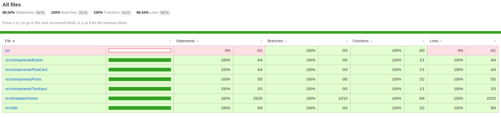

# TemplateCards_ReactJS

<p align="center">
  
  
  
  
  
  
  
  
  
</p>


Este projeto foi inicializado com [Create React App](https://github.com/facebook/create-react-app).

<br>

## Instalação

Você precisará ter apenas o [NodeJS](https://nodejs.org) instalado na sua máquina, e após isso, clonar este repositório:
```sh
  $ git clone https://github.com/leandross86/TemplateCards_ReactJS.git
```

Depois disso acesse o diretório e instale as dependências executando o seguinte comando:
```sh
  $ yarn install # ou npm install
```

<br>

## Executando a aplicação

Execute o comando a baixo para inicializar o
```sh
  $ yarn start # ou npm start
```

<br>

## Executando testes

Execute o comando a baixo para inicializar o
```sh
  $ yarn test # ou npm test
```

<br>

## Coverage

Execute o comando a baixo para inicializar os testes

```sh
  $ yarn test -- --coverage # ou npm test -- --coverage
```


<br>

## Como contribuir

- Fork esse repositório;
- Crie uma branch com a sua feature: `git checkout -b my-feature`
- Commit suas mudanças: `git commit -m 'feat: My new feature'`
- Push a sua branch: `git push origin my-feature`

Depois que o merge da sua pull request for feito, você pode deletar a sua branch.

## Licença

Esse projeto está sob a licença MIT. Veja o arquivo [LICENSE](LICENSE) para mais detalhes.

## 🧱Status: Em desenvolvimento

Desenvolvido com ❤ por Leandro Souza
